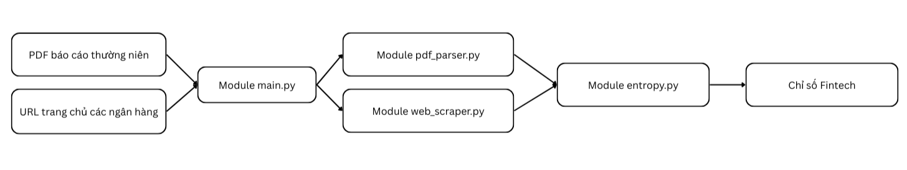

# Collect and Weight - CoW

**Collect and Weight (CoW)** is an automated data pipeline designed to collect unstructured financial data and apply the entropy weighting method to construct a robust Fintech Index. By scraping bank websites and parsing financial reports, CoW quantifies qualitative text into measurable data points for index calculation.

## Architecture & Execution Pipeline



### How It Works

The system is built on a modular architecture, coordinated by a central script:

* **`main.py`**: Serves as the primary connector and control center. It routes the incoming data sources to the appropriate processing engines to ensure nothing gets bottlenecked.
* **Data Extraction (PDF & Web)**: `main.py` passes the URLs and files into two specialized modules:
    1.  **Web Scraper Module**: A headless browser engine (Playwright) that navigates complex JavaScript-heavy bank websites to extract raw text.
    2.  **PDF Parser Module**: A dedicated engine for reading and extracting text from static financial reports (like Annual Reports and 10-Ks).
* **Standardization**: Both extraction modules process the unstructured text (e.g., counting keyword frequencies) and output the results into a unified, structured format.
* **The Entropy Module**: Finally, the standardized data is fed into the entropy calculator. This module applies the entropy weighting method to determine the objective weight of each data point, culminating in the final construction of the Fintech Index.

## Installation

This project uses Git for version control and requires a Python virtual environment to manage its dependencies safely. 

**1. Clone the repository**
```bash
git clone https://github.com/Duc-Thinh-47/CoW.git
cd ./CoW/
```

**2. Activate virtual environment**
```bash
venv\Scripts\activate
```

**3. Install dependencies**
```bash
pip install -r requirements.txt
playwright install
```